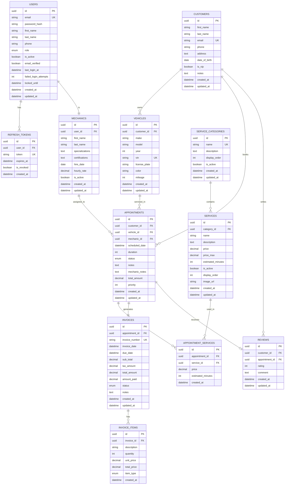

# Car Repair Service - Entity Relationship Diagram

## Mermaid ER Diagram (Render in supported markdown viewers)



## Quick Reference Tables

### Table Relationships Summary

| Parent Table | Child Table | Relationship Type | Description |
|--------------|-------------|-------------------|-------------|
| users | refresh_tokens | 1:M | One user can have multiple refresh tokens |
| users | mechanics | 1:1 | One user account per mechanic |
| customers | vehicles | 1:M | One customer can own multiple vehicles |
| customers | appointments | 1:M | One customer can have multiple appointments |
| customers | reviews | 1:M | One customer can write multiple reviews |
| vehicles | appointments | 1:M | One vehicle can have multiple appointments |
| mechanics | appointments | 1:M | One mechanic can be assigned to multiple appointments |
| appointments | appointment_services | 1:M | One appointment can include multiple services |
| appointments | invoices | 1:1 | One appointment generates one invoice |
| appointments | reviews | 1:1 | One appointment can have one review |
| services | appointment_services | 1:M | One service can be used in multiple appointments |
| service_categories | services | 1:M | One category contains multiple services |
| invoices | invoice_items | 1:M | One invoice contains multiple line items |

### Key Constraints

| Table | Constraint Type | Column(s) | Purpose |
|-------|----------------|-----------|---------|
| users | UNIQUE | email | Prevent duplicate accounts |
| vehicles | UNIQUE | vin | Ensure unique vehicle identification |
| vehicles | CHECK | year | Valid year range (1900-current+1) |
| vehicles | CHECK | vin | Exactly 17 characters |
| services | CHECK | price | Must be >= 0 |
| services | CHECK | price_max | Must be >= price |
| appointments | CHECK | duration | Must be > 0 |
| appointments | CHECK | priority | Must be 0, 1, or 2 |
| reviews | CHECK | rating | Must be 1-5 |
| invoices | CHECK | amount_paid | Must be >= 0 and <= total_amount |
| appointment_services | UNIQUE | (appointment_id, service_id) | Prevent duplicate service assignments |

### Cascade Rules

| Parent → Child | ON DELETE | ON UPDATE | Rationale |
|----------------|-----------|-----------|-----------|
| users → refresh_tokens | CASCADE | CASCADE | Remove tokens when user deleted |
| users → mechanics | CASCADE | CASCADE | Remove mechanic profile with user |
| customers → vehicles | CASCADE | CASCADE | Remove vehicles with customer |
| customers → appointments | RESTRICT | CASCADE | Prevent deleting customers with appointments |
| vehicles → appointments | RESTRICT | CASCADE | Prevent deleting vehicles with appointments |
| mechanics → appointments | SET NULL | CASCADE | Allow mechanic removal, keep appointment |
| service_categories → services | RESTRICT | CASCADE | Prevent deleting categories in use |
| services → appointment_services | RESTRICT | CASCADE | Prevent deleting services in use |
| appointments → appointment_services | CASCADE | CASCADE | Remove services with appointment |
| appointments → invoices | RESTRICT | CASCADE | Keep appointments with invoices |
| invoices → invoice_items | CASCADE | CASCADE | Remove items with invoice |

### Status Enumerations

#### User Roles
```
- Customer (0)
- Mechanic (1)
- Receptionist (2)
- Manager (3)
- Admin (4)
```

#### Appointment Status
```
- Pending: Initial state, awaiting confirmation
- Confirmed: Customer confirmed, ready for service
- InProgress: Work has started
- Completed: Service finished successfully
- Cancelled: Appointment cancelled by customer or shop
- NoShow: Customer didn't arrive
```

#### Invoice Status
```
- Draft: Invoice created but not finalized
- Pending: Awaiting payment
- Paid: Fully paid
- PartiallyPaid: Some payment received
- Overdue: Past due date without full payment
- Cancelled: Invoice cancelled
```

#### Invoice Item Types
```
- Service: Labor and service charges
- Part: Replacement parts
- Labor: Separate labor charges
- Other: Miscellaneous charges
```

### Index Performance Guide

#### High-Performance Indexes
These indexes are critical for common queries:

```sql
-- User authentication
idx_users_email

-- Appointment scheduling queries
idx_appointments_scheduled_date
idx_appointments_mechanic_date
idx_appointments_status_date

-- Customer lookup
idx_customers_email
idx_customers_phone

-- Vehicle lookup
idx_vehicles_vin
idx_vehicles_license_plate

-- Invoice queries
idx_invoices_invoice_number
idx_invoices_status_date
```

#### Composite Index Usage

```sql
-- Find appointments for specific customer on date range
idx_appointments_customer_date
-- Used in: WHERE customer_id = ? AND scheduled_date BETWEEN ? AND ?

-- Find mechanic availability
idx_appointments_mechanic_date
-- Used in: WHERE mechanic_id = ? AND scheduled_date BETWEEN ? AND ?

-- Active appointments by status
idx_appointments_status_date
-- Used in: WHERE status = ? AND scheduled_date >= ?
```

### Common Query Patterns

#### 1. Customer Appointment History
```sql
SELECT 
    a.scheduled_date,
    v.make, v.model, v.year,
    a.status,
    a.total_amount
FROM appointments a
JOIN vehicles v ON a.vehicle_id = v.id
WHERE a.customer_id = ?
    AND a.is_deleted = FALSE
ORDER BY a.scheduled_date DESC;
```
**Uses indexes:** `idx_appointments_customer_date`

#### 2. Daily Mechanic Schedule
```sql
SELECT 
    a.scheduled_date,
    c.first_name, c.last_name,
    v.make, v.model,
    a.duration,
    GROUP_CONCAT(s.name) AS services
FROM appointments a
JOIN customers c ON a.customer_id = c.id
JOIN vehicles v ON a.vehicle_id = v.id
JOIN appointment_services aps ON a.id = aps.appointment_id
JOIN services s ON aps.service_id = s.id
WHERE a.mechanic_id = ?
    AND DATE(a.scheduled_date) = ?
    AND a.status NOT IN ('Cancelled', 'NoShow')
    AND a.is_deleted = FALSE
GROUP BY a.id
ORDER BY a.scheduled_date;
```
**Uses indexes:** `idx_appointments_mechanic_date`

#### 3. Revenue by Period
```sql
SELECT 
    DATE(i.invoice_date) AS date,
    COUNT(*) AS invoice_count,
    SUM(i.total_amount) AS total_revenue,
    SUM(i.amount_paid) AS collected,
    SUM(i.total_amount - i.amount_paid) AS outstanding
FROM invoices i
WHERE i.invoice_date BETWEEN ? AND ?
    AND i.is_deleted = FALSE
GROUP BY DATE(i.invoice_date)
ORDER BY date;
```
**Uses indexes:** `idx_invoices_invoice_date`

#### 4. Popular Services
```sql
SELECT 
    s.name,
    COUNT(aps.id) AS booking_count,
    SUM(aps.price) AS total_revenue,
    AVG(aps.price) AS avg_price
FROM services s
JOIN appointment_services aps ON s.id = aps.service_id
JOIN appointments a ON aps.appointment_id = a.id
WHERE a.scheduled_date BETWEEN ? AND ?
    AND a.status = 'Completed'
    AND a.is_deleted = FALSE
GROUP BY s.id, s.name
ORDER BY booking_count DESC
LIMIT 10;
```
**Uses indexes:** `idx_appointments_status_date`, `idx_service_id`

### Data Integrity Checklist

✅ **Before Going Live:**

1. **Test Constraints**
   - [ ] Test UNIQUE constraints (email, VIN, license plate)
   - [ ] Test CHECK constraints (year range, price validation)
   - [ ] Test FOREIGN KEY constraints (cascades work correctly)

2. **Validate Triggers**
   - [ ] Appointment total updates correctly
   - [ ] Invoice status changes automatically
   - [ ] Timestamps update properly

3. **Test Procedures**
   - [ ] Invoice calculation is accurate
   - [ ] Mechanic availability detection works
   - [ ] No double-booking possible

4. **Performance Testing**
   - [ ] Query plans use indexes efficiently
   - [ ] Large dataset operations acceptable
   - [ ] Concurrent booking handling

5. **Security**
   - [ ] Application user has minimum required privileges
   - [ ] Password hashes are never exposed
   - [ ] Soft delete prevents data loss

---

**Generate this diagram online:**  
Copy the mermaid code block to: https://mermaid.live/

**Alternative ER Diagram Tools:**
- dbdiagram.io
- draw.io
- MySQL Workbench (File → Export → PNG)
